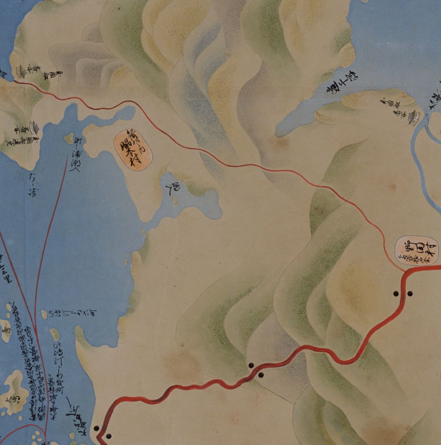
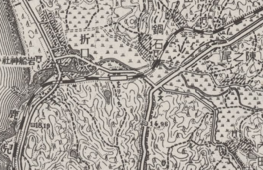

# ORD 3: 折口の交通史

## 概要

折口地区の交通がどう形成されてきたかを見る。

<iframe src="https://www.google.com/maps/embed?pb=!1m14!1m12!1m3!1d10866.942048315324!2d130.22276767221672!3d32.05931611947014!2m3!1f0!2f0!3f0!3m2!1i1024!2i768!4f13.1!5e0!3m2!1sen!2sjp!4v1707670312273!5m2!1sen!2sjp" width="600" height="450" style="border:0;" allowfullscreen="" loading="lazy" referrerpolicy="no-referrer-when-downgrade"></iframe>

## 江戸時代

江戸時代は特に街道沿いではなかったようだ。折口には何も記載がなく、農村地帯だったように見える。湾は見るからに交通に不便だが、折口川河口部分に渡し舟があったと何かで見たが、忘れた。

↑[薩摩国(元禄)](https://www.digital.archives.go.jp/DAS/pickup/view/detail/detailArchives/0301000000/0000000231/00)より。

## 明治時代

主要道が阿久根〜野田、阿久根〜脇本になった。現在残っている感じから見る限り、規格は高くない。

- 現在の地名とほぼ同じ
- 現在の国道3号線にあたる道はまだ存在しないか、主要道ではない

## 昭和時代(前)

交通手段が徒歩や馬の時代から、鉄道や自動車の時代になり、本格的に交通網に取り込まれた。傾斜やトンネルを避けて通されたためか。おそらく国道3号(途中変遷しているから違うかも)、鹿児島本線(これも途中変遷しているから違うかも)が見える。折口駅も開業した。

↑[五万分一地形圖](https://purl.stanford.edu/kq741wk9448) 明治34年測量、昭和10年修正

## 昭和時代(後)

- 戦後土地改良工事が行われ折口川が直線化した
  - 同時期に橋がいくつかかけられた

脇本バイパスが完成した。新設されたバイパスに国道389号があてられ、今まで国道389号だった道路を県道365号に降格。

 [広報あくね490号](https://www.city.akune.lg.jp/material/files/group/67/kohoS6211.pdf)より

- 旧国道389号線には鉄道との平面交差、狭隘区間があり、脇本地区の物資輸送の妨げとなっていた

## 平成

高規格幹線道路と接続され、初めて高速交通網に組み込まれた。国道x2、高速道路x1、地域高規格道路(北薩横断道路の計画)x1、肥薩おれんじ鉄道線の結節点となる。地区がちょうど険阻な山あいのなかのちょうどいい平地に位置したというだけだが、利便性が向上している。

- 九州新幹線の開業によって薩摩川内〜八代駅間が第三セクター化した。折口駅は肥薩おれんじ鉄道駅となった。通過する特急が多くを占めていたため、折口駅の停車本数自体は減ったわけではないが不便に
- 南九州西回り自動車道の北阿久根インターチェンジが設置され国道3号、国道389号と接続された。
- 北薩横断道路の終点として設定された(未定)。

## 関連

[ORD: 2](./2.md)。干拓が行われた。
