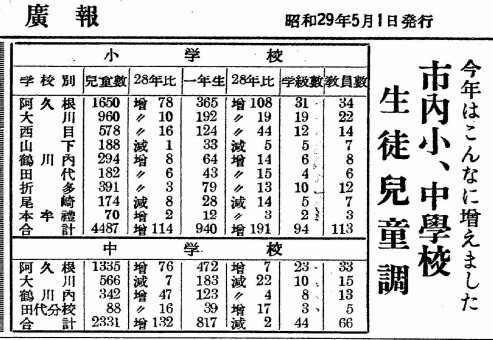
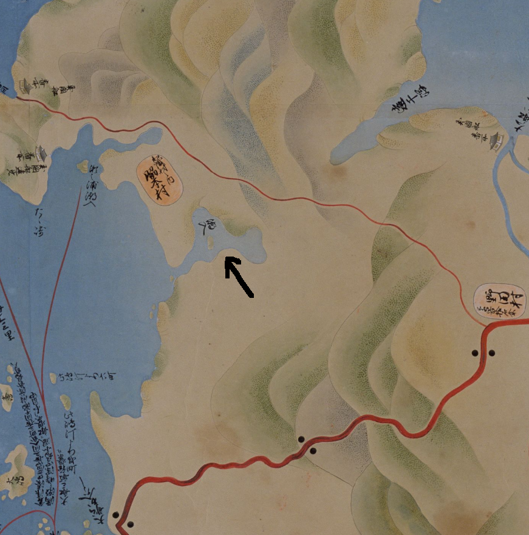
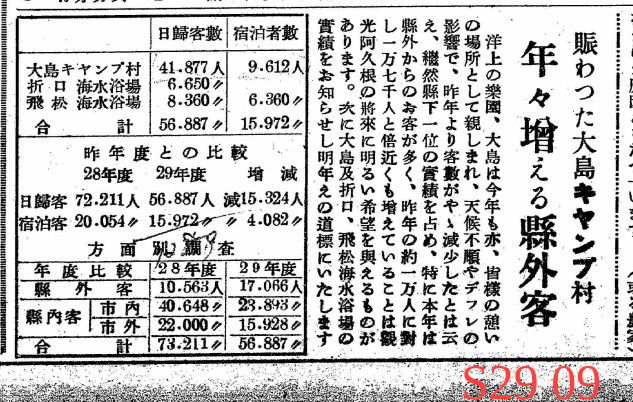
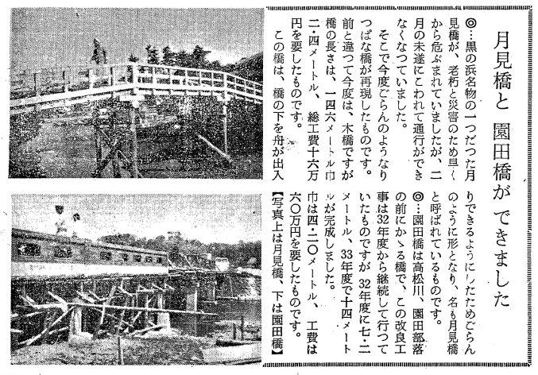
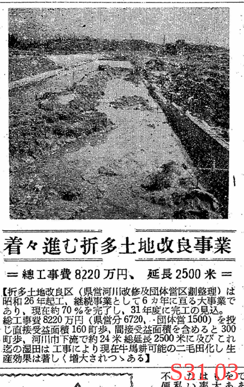
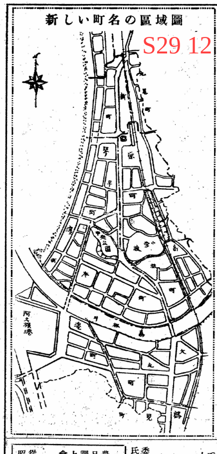
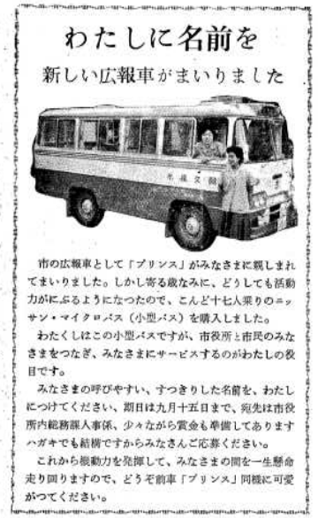

# メモ

阿久根市折口

## 人口

昭和28年(1953)5月の学校ごとの人数

各学校の人数。多い。今とは全然異なる。特に大川が多いのが不思議。薩摩街道だったためか? まだ三笠町は合併してないので記載はない。

## 道路

[鹿児島県道365号脇本赤瀬川線 \- Wikipedia](https://ja.wikipedia.org/wiki/%E9%B9%BF%E5%85%90%E5%B3%B6%E7%9C%8C%E9%81%93365%E5%8F%B7%E8%84%87%E6%9C%AC%E8%B5%A4%E7%80%AC%E5%B7%9D%E7%B7%9A)

- 1989年（平成元年）3月29日 - 鹿児島県告示第696号により「鹿児島県道365号折口陣之尾線」が廃止され、告示697号により鹿児島県道365号脇本赤瀬川線として認定される
- 現在の国道389号が開通するまではこの鹿児島県道365号脇本赤瀬川線を国道389号としていた
  - 1987年脇本バイパスと呼ばれる区間が開通
    - 開通時の記事
    - 広報あくね490号 https://www.city.akune.lg.jp/material/files/group/67/kohoS6211.pdf

## 時代の変遷

折口地区は、時代の変遷とともに役割を変えてきた。

### 江戸時代 元禄(=1688〜1704年)

干拓前。

↑[薩摩国(元禄)](https://www.digital.archives.go.jp/DAS/pickup/view/detail/detailArchives/0301000000/0000000231/00)より。田島は本当に島だった。

↑現在の標高別地図。だいたい一致する。地理院地図より作成。

周辺で育った人なら聞く話しだが、折口地区は一面が海だった。土を掘ると貝殻が出てくる話とセットで語られる。そして地域名の由来は、「海への降り口」である。海でなくなったのは人為的なもので、割と最近であった。

>多田村の西に位置し、地元では「おいぐち」とも発音する。西は海（東シナ海）に面し、西流する折口川が注ぐ。南は赤瀬川村、北西は出水郷西目村。折口川河口の入江を折口浜とよぶ。かつてこの入江は折口川をさかのぼって多田村辺りまで入り込み、多田浦とよばれていた。元禄年中（一六八八―一七〇四）この浦の干拓が進み、開発地を中心として多田村から分れた村が当村という（阿久根町郷土誌）。

### 明治時代

干拓後。

↑[西海道全圖](https://sagalibdb.jp/iiifviewer/?uid=02000035) 1877年 陸軍参謀局

- [西海道全図](http://www.aobane.com/books/390)の概要
- 主要道が阿久根〜野田、阿久根〜脇本になっている。現在残っている感じから見る限り、規格の高くない道で自動車のための道ではない
- 現在の地名とほぼ同じ
- 現在の国道3号線にあたる道は存在しないか、主要道ではない

### 昭和時代(前)

↑[五万分一地形圖](https://purl.stanford.edu/kq741wk9448) 明治34年測量、昭和10年修正

- 鹿児島本線の折口駅が開業した(1923年)
  - 傾斜とトンネルを避けて海側を通した?
- 現在の国道3号と同じ位置に道路ができた
  - 折口は阿久根脇本間道路と、国道3号間の連絡路となった

### 昭和時代(後)

- 戦後土地改良工事が行われ折口川が直線化した
  - 同時期に橋がいくつかかけられた

### 平成

脇本バイパスが完成した。新設されたバイパスに国道389号があてられ、今まで国道389号だった道路を県道365号に降格。

 [広報あくね490号](https://www.city.akune.lg.jp/material/files/group/67/kohoS6211.pdf)より

- 旧国道389号線には鉄道との平面交差、狭隘区間があり、脇本地区の物資輸送の妨げとなっていた

南九州西回り自動車道のインターチェンジが設置された。北薩横断道路の終点として設定された(未定)。

## 観光

大島キャンプ場の人数。重視していたことがわかる。

昭和27年の観光の人数。県で1位だったとのこと(何をもってかわからないが…)。鹿児島県内の旅行先によく選ばれていた時期があると聞いたことがある。

## 郷土史

赤瀬川の無銘の墓は外国人の墓とのこと。

市街地に橋の印象がないので、どちらも現存してない。なにか跡があるかもしれない。

似たような話は折口にもある。波留にもあった。

中央公園の不動明王の解説。

密貿易の島だったという。上陸は難しいらしい。

阿久根の来歴に関する資料。

## 折口

陣之尾は養蚕業が盛んだったとのこと。

折多地区土地改良工事中の貴重な写真。ぐちゃぐちゃ。どのへんか不明。

- 阿久根市には平地が少ない。増産の余地のある数少ない田園地帯の1つだった。戦後最優先で建設されたように見える
- 折口川の流路が大きく変わった。以前は蛇行していて、河口付近でふた手に分かれていた。現在は1つになっている
  - 1940年代の航空写真で確認できる
- 土地改良工事は昭和26年(1951)から開始され、昭和31年(1956)に完工した
- 阿久根市報のバックナンバーは昭和26年から公開されているが、初期は状態が悪く文字を判別するのが難しい。まだ手書きで写真の掲載はないようなので、記事があったとしても画像を確認するのは難しい。文献を調べる必要がありそう
  - 市誌か、新聞のバックナンバーを見る
- 排水 + 土地改良 で構成される

おそらく現存する。ボロい建物だとは思っていた。

小学校の校門と校舎の建設。校門は現存している。

内田の石堤。どこかはよくわからない。

## 神社

[石船神社 \| 鹿児島県神社庁](https://www.kagojinjacho.or.jp/shrine-search/area-hokusatsu/%E9%98%BF%E4%B9%85%E6%A0%B9%E5%B8%82/416/)

>古老の言い伝えによると、神代の昔、御祭神が石樟船に乗りここへ流れ着かれたので祀られたという。当社より五十間ばかりの波限にその石樟船といわれる大岩があり、帆柱を立てた跡や、艫には柁床の跡があり、又、柁は出水郷隼人の瀬戸の柁折の瀬というところにある奇岩がそれであるという。
>阿久根市誌(昭和49年刊)1020頁にある言い伝えによれば、建久三年(一一九二)鎌倉幕府の命により、山門院に下向した田上資一が氏神として建立したものといわれている。棟札には「慶長十六亥八月十四日大檀那藤原義虎公　子孫繁昌…」と記されている。
>出水風土誌(大正4年刊,昭和51年復刻)523頁によれば　建久三年三月鎌倉の命に依り山門院筒田郷に下向した、上出水村武本田上氏の始祖田江資一(四代目より田上を名乗る)が氏神として創建す。当社の傍らに船形の巨岩あり。田上隠岐守漂着の軍用船化石なり。地理纂考に曰く往古漂着せし唐船の化石であると。

- 民話 広報あくね460号 https://www.city.akune.lg.jp/material/files/group/67/kohoS6005.pdf

## 地図

埋め立てる前の地図。砂浜が町のすぐそばに広がっていたことが確認できる。北部ではまだ橋ができていないので、鉄道と国道が立体交差していない。

## その他

なんか面白い。

体育大会の記録。入賞しまくっている。

